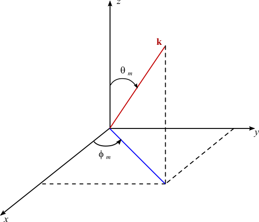

===================================================================
Synthetic Isotropic Turbulence based on a Specified Energy Spectrum
===================================================================

:Author: Tony Saad

Formulation
===========

We start with a generalized Fourier series for a real valued scalar
function

.. math:: u=a_{0}+\sum_{m=1}^{M}a_{m}\cos(\frac{2\pi mx}{L})+b_{m}\sin(\frac{2\pi mx}{L})

For simplicity, we set :math:`k_{m}\equiv\frac{2\pi m}{L}` as the
:math:`m^{\mbox{th}}` wave number. Also, if the mean of :math:`f` is
known, we have

.. math:: \int_{0}^{L}u\,\text{d}x=a_{0}

Hence, for a turbulent velocity field with zero mean (in space), we can
set :math:`a_{0}=0`. At the outset, we have

.. math:: u=\sum_{m=1}^{M}a_{m}\cos(k_{m}x)+b_{m}\sin(k_{m}x)

We now introduce the following changes

.. math:: a_{m}=\hat{u}_{m}\cos(\psi_{m});\quad b_{m}=\hat{u}_{m}\sin(\psi_{m});\quad\hat{u}_{m}^{2}=a_{m}^{2}+b_{m}^{2},\quad\psi_{m}=\arctan(\frac{b_{m}}{a_{m}})

then

.. math::

   \begin{alignedat}{1}a_{m}\cos(k_{m}x)+b_{m}\sin(k_{m}x) & =\hat{u}_{m}\cos(\psi_{m})\cos(k_{m}x)+\hat{u}_{m}\sin(\psi_{m})\sin(k_{m}x)\\
    & =\hat{u}_{m}\cos(k_{m}x-\psi_{m})
   \end{alignedat}

so that

.. math:: u=\sum_{m=1}^{M}\hat{u}_{m}\cos(k_{m}x-\psi_{m})

The extension to 3D follows

.. math:: u=\sum_{m=1}^{M}\hat{u}_{m}\cos(\mathbf{k}_{m}\cdot\mathbf{x}-\psi_{m})

.. math:: \varv=\sum_{m=1}^{M}\hat{\varv}_{m}\cos(\mathbf{k}_{m}\cdot\mathbf{x}-\psi_{m})

.. math:: w=\sum_{m=1}^{M}\hat{w}_{m}\cos(\mathbf{k}_{m}\cdot\mathbf{x}-\psi_{m})

where :math:`\mathbf{k}_{m}\equiv(k_{x,m},k_{y,m},k_{z,m})` is the
position vector in wave space and :math:`\mathbf{x}\equiv(x,y,z)` is the
position vector in physical space. Therefore,
:math:`\mathbf{k}_{m}\cdot\mathbf{x}_{m}=k_{x,m}x+k_{y,m}y+k_{z,m}z`. A
condensed form is

.. math:: \mathbf{u}=\sum_{m=1}^{M}\hat{\mathbf{u}}_{m}\cos(\mathbf{k}_{m}\cdot\mathbf{x}-\psi_{m})

where
:math:`\hat{\mathbf{u}}_{m}\equiv(\hat{u}_{m},\hat{v}_{m},\hat{w}_{m})`.
Continuity dictates that

.. math:: \frac{\partial u}{\partial x}+\frac{\partial\varv}{\partial y}+\frac{\partial w}{\partial z}=0

This gives

.. math:: -\sum_{m=1}^{m}\left(k_{x,m}\hat{u}_{m}+k_{y,m}\hat{v}_{m}+k_{z,m}\hat{w}_{m}\right)\sin(\mathbf{k}_{m}\cdot\mathbf{x}-\psi_{m})=0

or

.. math:: \sum_{m}\mathbf{k}_{m}\cdot\hat{\mathbf{u}}_{m}\sin(\mathbf{k}_{m}\cdot\mathbf{x}-\psi_{m})=0\label{eq:continuity-continuous}

This equation can be enforced by setting

.. math:: \mathbf{k}_{m}\cdot\hat{\mathbf{u}}_{m}=0,\;\forall\:m\in\{0,1,\cdots,M\}

 This means that the Fourier coefficients have different directions in
wave space. We therefore write the Fourier coefficients as

.. math:: \hat{\mathbf{u}}_{m}\equiv q_{m}\boldsymbol{\sigma}_{m}\mid\mathbf{k}_{m}\cdot\boldsymbol{\sigma}_{m}=0

where :math:`\boldsymbol{\sigma}_{m}` is a unit vector computed such
that :math:`\mathbf{k}_{m}\cdot\boldsymbol{\sigma}_{m}=0` at any point
:math:`\mathbf{x}`. Note that this is the original formulation presented
in :raw-latex:`\cite{davidson2008hybrid}`. While is true in the
continuous sense, it becomes invalid when discretized leading to a
diverging velocity field. I will show you how to fix this in the next
paragraph.

The velocity vector at point :math:`\mathbf{x}` is now at hand

.. math:: \mathbf{u}(\mathbf{x})=\sum_{m=1}^{M}q_{m}\cos(\mathbf{k}_{m}\cdot\mathbf{x}-\psi_{m})\boldsymbol{\sigma}_{m}

The last step is to link :math:`q_{m}` to the energy spectrum. This can
be computed from

.. math:: q_{m}=2\sqrt{E(k_{m})\Delta k}

Enforcing Continuity
====================

Given an analytic vector field :math:`\mathbf{u}` such that
:math:`\nabla\cdot\mathbf{u}=0`, we show here that this does not hold
for the discrete continuity equation. Since different codes use
different discretization schemes for the dilatation term (staggered vs
collocated), one must first write the divergence formula in the desired
discrete form and then infer the condition that enforces discrete
divergence. A classic example is the Taylor-Green vortex initialization.
This velocity field is given by

.. math:: u=\sin x\cos y

.. math:: \varv=-\cos x\sin y

It is true that, for this velocity field,
:math:`\nabla\cdot\mathbf{u}=0` because

.. math:: \nabla\cdot\mathbf{u}=\frac{\partial u}{\partial x}+\frac{\partial\varv}{\partial y}=\cos x\cos y-\cos x\cos y=0

However, when used to initialize a discrete grid, the resulting discrete
continuity equation does not always hold true. Take for instance the
Taylor-Green vortex and initialize a staggered grid. Continuity, to
second order in space on a staggered grid implies

.. math:: \frac{\partial u}{\partial x}+\frac{\partial\varv}{\partial y}\approx\frac{u(x+\tfrac{\Delta x}{2},y)-u(x-\tfrac{\Delta x}{2},y)}{\Delta x}+\frac{\varv(x,y+\tfrac{\Delta y}{2})-\varv(x,y-\tfrac{\Delta y}{2})}{\Delta y}

Then, using the formula for :math:`u` and :math:`\varv`, e.g.
:math:`u(x+\tfrac{\Delta x}{2},y)=\sin(x+\tfrac{\Delta x}{2})\cos y`,
etc..., one recovers

.. math:: \frac{\partial u}{\partial x}+\frac{\partial\varv}{\partial y}\approx2\cos x\cos y\left[\frac{\sin\left(\frac{\Delta x}{2}\right)}{\Delta x}-\frac{\sin\left(\frac{\Delta y}{2}\right)}{\Delta y}\right]

which is guaranteed to be zero when :math:`\Delta x=\Delta y`. A
nonuniform grid spacing will always result in a diverging initial
condition. The overall less that I’d like to convey here is that it is
generally preferable to operate with the discrete form of equations
since those usually bring up hidden issues that can be easily missed in
the continuous sense.

Back to our isotropic velocity field, recall that

.. math:: \mathbf{u}(\mathbf{x})=\sum_{m=1}^{M}q_{m}\cos(\mathbf{k}_{m}\cdot\mathbf{x}-\psi_{m})\boldsymbol{\sigma}_{m}

 Now, write the continuity equation in discrete form, assuming a
staggered grid, we have

.. math:: \frac{\partial u}{\partial x}+\frac{\partial\varv}{\partial y}+\frac{\partial w}{\partial z}\approx\frac{u(x+\tfrac{\Delta x}{2},y,z)-u(x-\tfrac{\Delta x}{2},y,z)}{\Delta x}+\frac{\varv(x,y+\tfrac{\Delta y}{2},z)-\varv(x,y-\tfrac{\Delta y}{2},z)}{\Delta y}+\frac{w(x,y,z+\tfrac{\Delta z}{2})-w(x,y,z-\tfrac{\Delta z}{2})}{\Delta z}

Here, for example,

.. math:: u(x+\tfrac{\Delta x}{2},y,z)=\sum_{m=1}^{M}q_{m}\cos(k_{m,x}(x+\tfrac{\Delta x}{2})+k_{m,y}y+k_{m,z}z-\psi_{m})\sigma_{m,x}

 Upon careful substitution and tedious trigonometric operations (which
are rendered begnin when using mathematica, bless Stephen Wolfram), we
recover the following

.. math:: \frac{\partial u}{\partial x}+\frac{\partial\varv}{\partial y}+\frac{\partial w}{\partial z}\approx-\sum_{m=1}^{M}2\left[\frac{\sigma_{m,x}}{\Delta x}\sin(\tfrac{1}{2}k_{m,x}\Delta x)+\frac{\sigma_{m,y}}{\Delta y}\sin(\tfrac{1}{2}k_{m,y}\Delta y)+\frac{\sigma_{m,z}}{\Delta z}\sin(\tfrac{1}{2}k_{m,z}\Delta z)\right]\sin(\mathbf{k}_{m}\cdot\mathbf{x}-\psi_{m})

or, written in a more convenient form

.. math:: \frac{\partial u}{\partial x}+\frac{\partial\varv}{\partial y}+\frac{\partial w}{\partial z}\approx-\sum_{m=1}^{M}\boldsymbol{\sigma}_{m}\cdot\tilde{\mathbf{k}}_{m}\sin(\mathbf{k}_{m}\cdot\mathbf{x}-\psi_{m})\label{eq:continuity-discrete}

where

.. math:: \tilde{\mathbf{k}}_{m}\equiv\frac{2}{\Delta x}\sin(\tfrac{1}{2}k_{m,x}\Delta x)\mathbf{i}+\frac{2}{\Delta y}\sin(\tfrac{1}{2}k_{m,y}\Delta y)\mathbf{j}+\frac{2}{\Delta z}\sin(\tfrac{1}{2}k_{m,z}\Delta z)\mathbf{k}

A sufficient condition for the discrete continuity equation given in to
be zero is to make

.. math:: \boldsymbol{\sigma}_{m}\cdot\tilde{\mathbf{k}}_{m}=0,\quad\forall m

This means that instead of selecting :math:`\boldsymbol{\sigma}_{m}`
such that it is perpendicular to
:math:`\mathbf{k}_{m}`\ (:math:`\boldsymbol{\sigma}_{m}\cdot\mathbf{k}_{m}=0`),
we instead choose :math:`\boldsymbol{\sigma}_{m}`\ to be perpendicular
to :math:`\tilde{\mathbf{k}}_{m}`. Interestingly, in the limit as the
grid spacing approaches zero, :math:`\tilde{\mathbf{k}}_{m}` will
approach :math:`\mathbf{k}_{m}`. This is so cool!

In Practice
===========

   Angles associated with wave number :math:`\mathbf{k}_{m}`.

-  Specify the number of modes :math:`M`. This will determine the
   Fourier representation of the velocity field at every point in the
   spatial domain

-  Compute or set a minimum wave number :math:`k_{0}`

-  Compute a maximum wave number
   :math:`k_{\text{max }}=\frac{\pi}{\Delta x}`. For multiple
   dimensions, use
   :math:`k_{\text{max}}=\max(\frac{\pi}{\Delta x},\frac{\pi}{\Delta y},\frac{\pi}{\Delta z})`

-  Generate a list of :math:`M` modes:
   :math:`k_{m}\equiv k(m)=k_{0}+\frac{k_{\text{max}}-k_{\text{0}}}{M}(m-1)`.
   Those will correspond to the magnitude of the vector
   :math:`\mathbf{k}_{m}`. In other words, :math:`k_{m}` is the radius
   of a sphere.

-  Generate four arrays of random numbers, each of which is of size M
   (those will be needed next). Those will correspond to the angles:
   :math:`\theta_{m}`, :math:`\varphi_{m}`, :math:`\psi_{m}`, and
   :math:`\alpha_{m}`.

-  | Compute the wave vectors. To generate as much randomness as
     possible, we write the wave vector as a function of two angles in
     3D space. This means
   | 

     .. math:: k_{x,m}=\sin(\theta_{m})\cos(\varphi_{m})k_{m}

     .. math:: k_{y,m}=\sin(\theta_{m})\sin(\varphi_{m})k_{m}

     .. math:: k_{x,m}=\cos(\theta_{m})k_{m}

-  | Compute the unit vector :math:`\boldsymbol{\sigma}_{m}`. Note that
     :math:`\boldsymbol{\sigma}_{m}` lies in a plane perpendicular to
     the vector :math:`\mathbf{k}_{m}`. We choose the following
   | 

     .. math:: \sigma_{x,m}=\cos(\theta_{m})\cos(\varphi_{m})\cos(\alpha_{m})-\sin(\varphi_{m})\sin(\alpha_{m})

     .. math:: \sigma_{y,m}=\cos(\theta_{m})\sin(\varphi_{m})\cos(\alpha_{m})+\cos(\varphi_{m})\sin(\alpha_{m})

     .. math:: \sigma_{z,m}=-\sin(\theta_{m})\cos(\alpha_{m})

-  To enforce continuity, compute vector :math:`\tilde{\mathbf{k}}_{m}`
   and make :math:`\boldsymbol{\sigma}_{m}` perpendicular to
   :math:`\tilde{\mathbf{k}}_{m}`.

-  Once those quantities are computed, loop over the mesh. For every
   point on the mesh, loop over all M modes. For every mode, compute
   :math:`q_{m}=2\sqrt{E(k_{m})\Delta k}` and
   :math:`\beta_{m}=\mathbf{k}_{m}\cdot\mathbf{x}-\psi_{m}`. Finally,
   construct the following summations (at every point :math:`(x,y,z)`
   you will have a summation of :math:`M`-modes)

.. math:: u(x,y,z)=\sum_{n=1}^{M}q_{m}\cos(\beta_{m})\sigma_{x,m}

.. math:: \varv(x,y,z)=\sum_{n=1}^{M}q_{m}\cos(\beta_{m})\sigma_{y,m}

.. math:: w(x,y,z)=\sum_{n=1}^{M}q_{m}\cos(\beta_{m})\sigma_{z,m}
